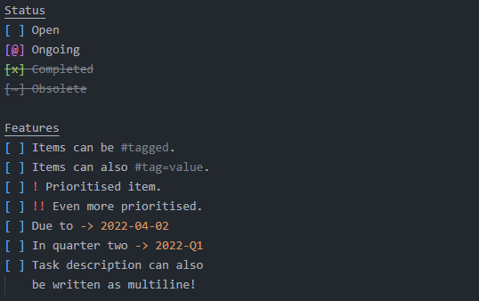

# xit!

This extension provides language support for [xit!](https://xit.jotaen.net/).

- [Syntax Highlighting](#syntax-highlighting)
- [Shortcuts](#shortcuts)
- [Snippets](#snippets)

## Syntax Highlighting



### Customization

If the colors and looks of the syntax highlighting is not correct or as fancy as you want to, you can try to edit the `tokenColorCustomizations` in the user settings.

```json
{
    "editor.tokenColorCustomizations": {
        "textMateRules": [{
            // Replace this with the scope you want to edit.
            // Available scopes are:
            // - markup.other.task.title.xit
            // - markup.other.task.checkbox.open.xit
            // - markup.other.task.checkbox.ongoing.xit
            // - markup.other.task.checkbox.checked.xit
            // - markup.other.task.checkbox.obsolete.xit
            // - markup.other.task.checkbox.inquestion.xit
            // - markup.other.task.description.closed.xit
            // - markup.other.task.priority.xit
            // - markup.other.task.date.xit
            // - markup.other.task.tag.xit
            "scope": "markup.other.task.checkbox.open.xit",
            "settings": {
                // Customize open checkbox color
                "foreground": "#00FF00",
                // ... and the fontStyle
                "fontStyle": "bold"
            }
        }]
    }
}
```

### Strikethrough Not Working?

If closed tasks (completed/obsolete) are not striketroughed, then you may want to explicitly specify that the strikethrough scope is striketroughed. This is happening because your theme did not specify the striketrough rule.

```json
{
    "editor.tokenColorCustomizations": {
        "[Theme That Is Not Working]": {
            "textMateRules": [
                {
                    "scope": "markup.strikethrough",
                    "settings": {
                        "fontStyle": "strikethrough"
                    }
                }
            ]
        }
    }
}
```

## Shortcuts

The extension provides shortcuts for toggling/shuffling checkbox state. The shortcuts are configured by default as shown below:

- `ctrl+space` - Toggle checkboxes if available, else trigger editor suggestions.
- `ctrl+alt+x` - Toggle all selected checkboxes.
- `ctrl+alt+d` - Shuffle all selected checkboxes. This will shift the checkbox state to `' ' -> '@' -> '~' -> 'x'`.

## Snippets

- `u` - Unchecked (`[ ] `)
- `a`/`@` - Ongoing (`[@] `)
- `o`/`~` - Obsolete (`[~] `)
- `x` - Checked (`[x] `)
- `q` - Question (`[?] `)
